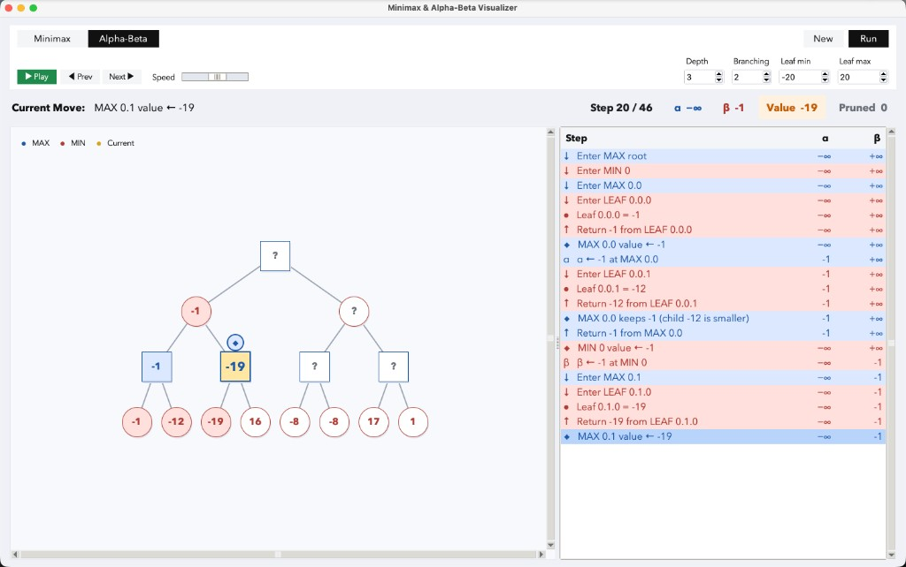

# Minimax and Alpha-Beta Pruning Visualizer

A single-file Python app that builds a random game tree and steps through **minimax** or **alpha-beta** search with a live tree view and step log.

## Demo



## Requirements

- Python 3
- Tkinter (included with most Python installs on macOS)

## Run

```bash
python visualizer.py
```

## Usage

1. Choose **Minimax** or **Alpha-Beta**, set **depth**, **branching**, and leaf value range.
2. Click **New** to generate a tree, then **Run** to record the algorithm trace.
3. Use **Prev** / **Next** or **Play** to animate. Arrow keys step; Space toggles play.

The tree shows MAX (square) and MIN (circle) nodes. The step table lists each move with **α** and **β** during alpha-beta search.
